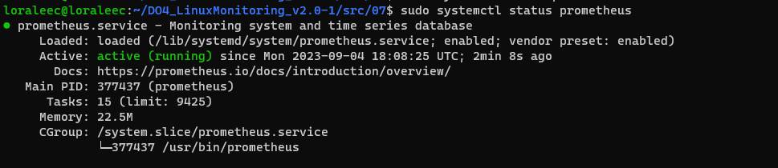
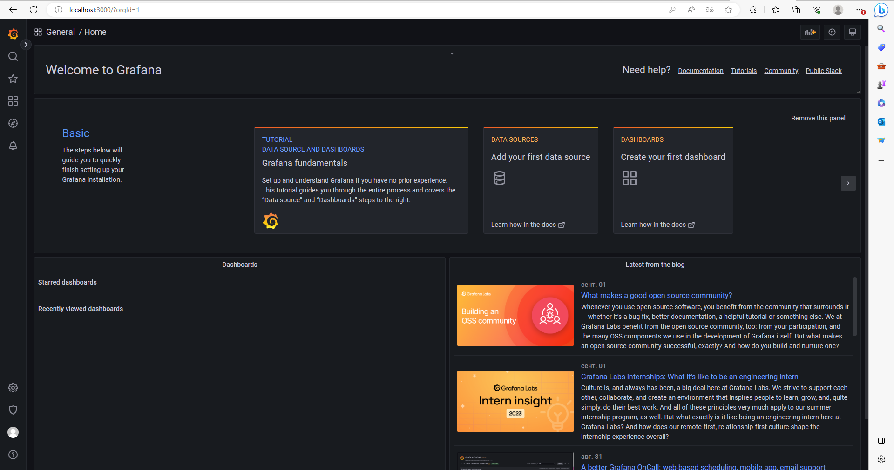
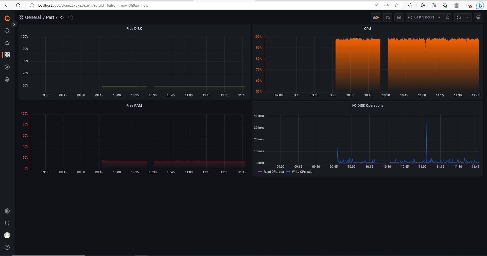
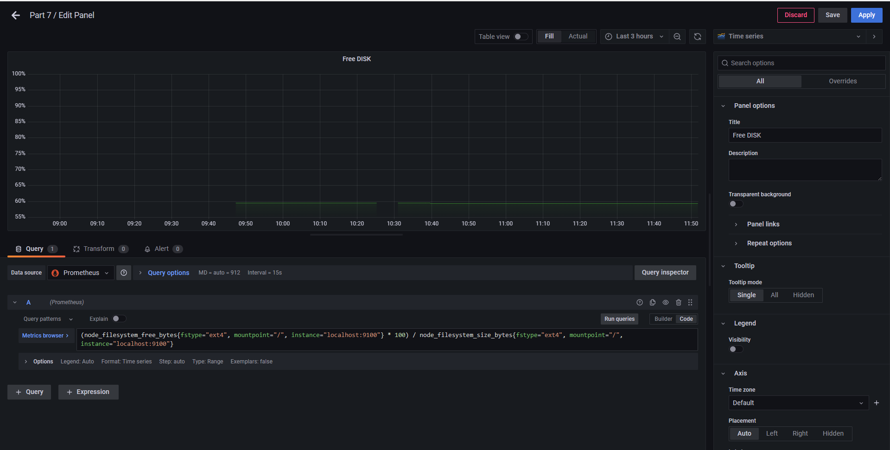
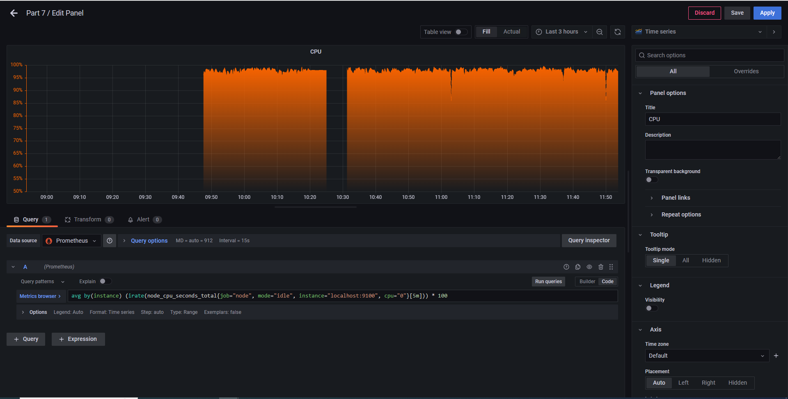
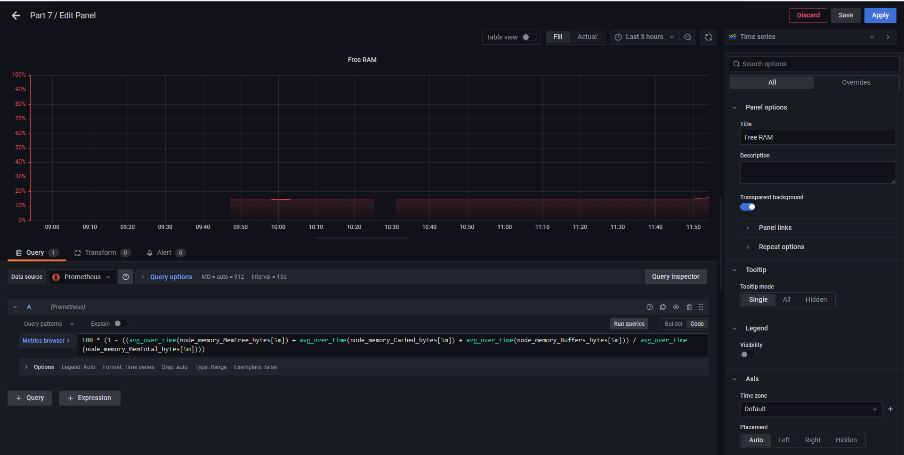
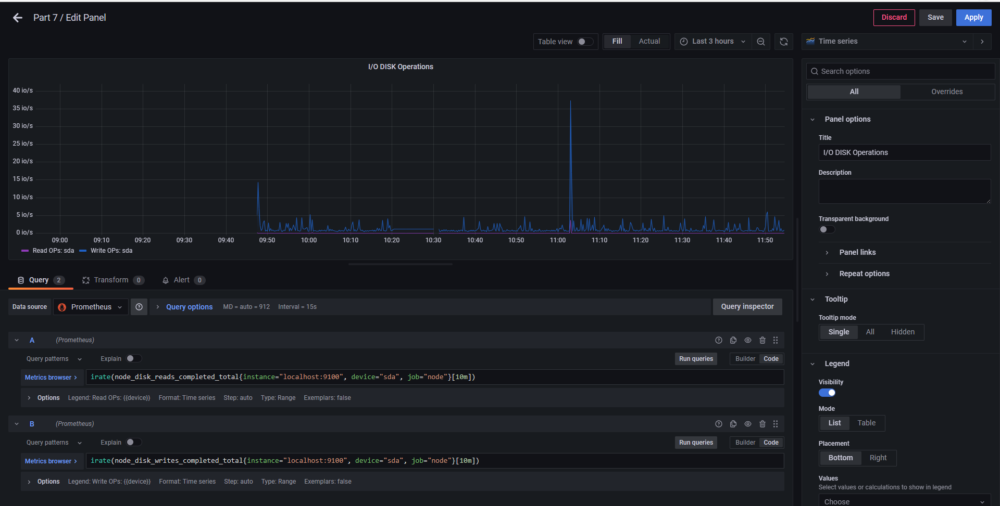
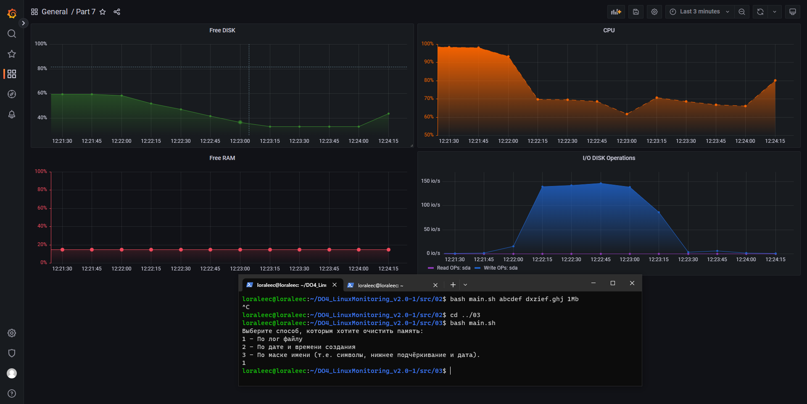

## Part 7. Prometheus и Grafana

### Установить и настроить Prometheus и Grafana на виртуальную машину

**Установка Prometheus**

> sudo apt install prometheus

Запуск

> sudo systemctl start prometheus

Проверка работоспобности

> sudo systemctl status prometheus

Далее установим **Grafana**

> wget https://dl.grafana.com/oss/release/grafana_9.2.4_amd64.deb

> sudo dpkg -i grafana_9.2.4_amd64.deb && \ sudo systemctl enable grafana-server && sudo systemctl start grafana-server

### Получить доступ к веб интерфейсам Prometheus и Grafana с локальной машины

Далее замапим порты с 3000 на виртуалке на 3000 на локальной машине и проверим отдачу странички Графаны по адресу localhost:3000

Скачаем и установим Node-exporter

> wget https://github.com/prometheus/node_exporter/releases/download/v1.6.1/node_exporter-1.6.1.linux-amd64.tar.gz

> tar xvf node_exporter-1.6.1.linux-amd64.tar.gz

### Добавить на дашборд Grafana отображение ЦПУ, доступной оперативной памяти, свободное место и кол-во операций ввода/вывода на жестком диске

Далее свяжем Графану и Прометеус друг с другом и настроим дашборд  
После настройки всех панелей на дашборде, он выглядит следующим образом: 

### Запустить ваш bash-скрипт из Части 2
### Посмотреть на нагрузку жесткого диска (место на диске и операции чтения/записи)

### Установить утилиту stress и запустить команду stress -c 2 -i 1 -m 1 --vm-bytes 32M -t 10s
### Посмотреть на нагрузку жесткого диска, оперативной памяти и ЦПУ

