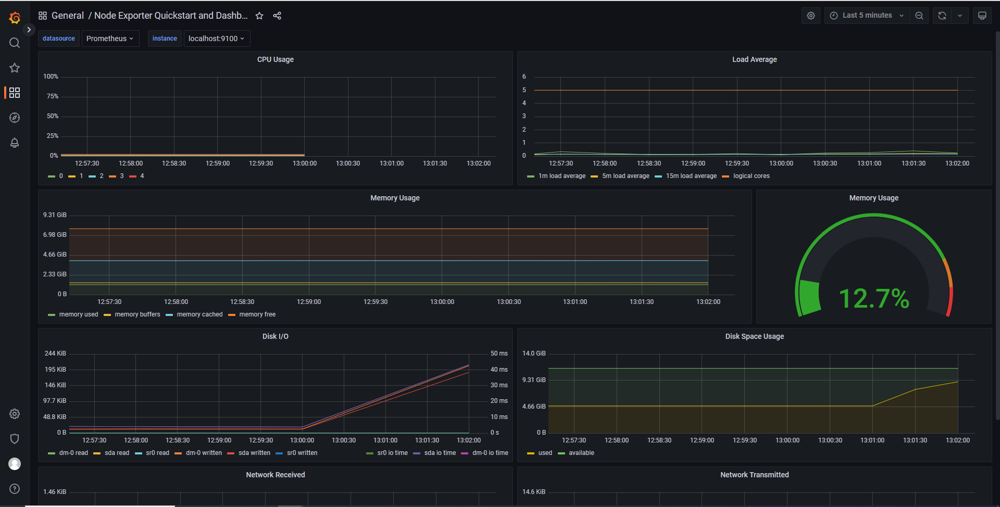

## Part 8. Готовый дашборд

### Установить готовый дашборд Node Exporter Quickstart and Dashboard с официального сайта Grafana Labs

### Провести те же тесты, что и в Части 7

  
Запуск скрипта из 2 части

  
Использование stress

### Запустить ещё одну виртуальную машину, находящуюся в одной сети с текущей  
Была поднята вторая машина и настроена внутренняя сеть между виртуалками. Первая машина получила адрес 192.168.100.11, вторая 192.168.100.10  

  

### Запустить тест нагрузки сети с помощью утилиты iperf3

  

### Посмотреть на нагрузку сетевого интерфейса

  
