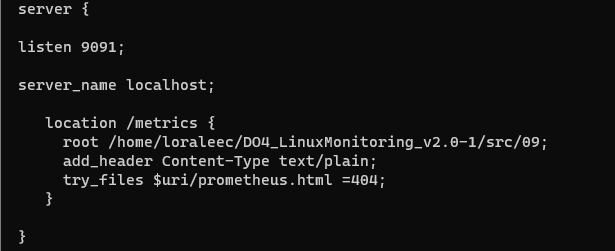
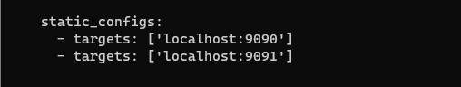
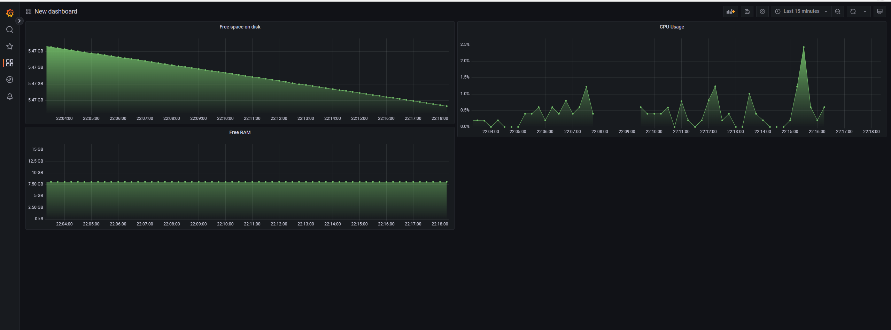
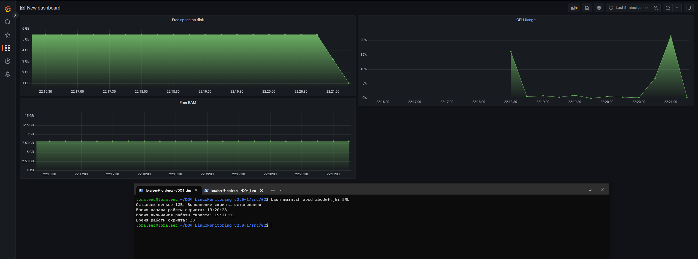
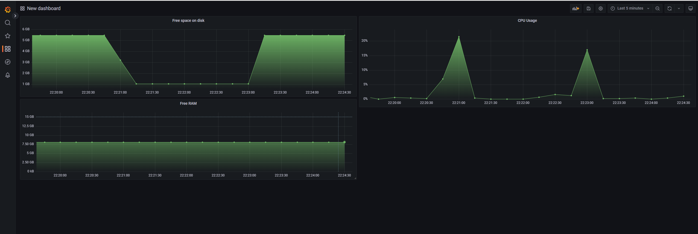
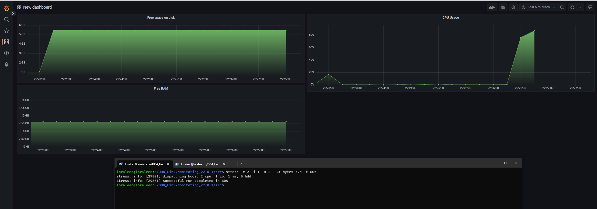

## Part 9. Дополнительно. Свой node_exporter

В конфигурацию nginx добавил следующее: 

  

Конфигурационный файл Прометеуса я поменял ранее, добавив туда следующее:  

  

Далее просто запускаем скрипт и nginx, настраиваем дашборд с нашими метриками и проверяем работоспособность

  

Запустим скрипт из Задания 2 и посмотрим на результат  

  

Далее очистим память скриптом из Задания 3  

После чистки показатели следующие:  

  

Проверим показатели системы командой  

> stress -c 2 -i 1 -m 1 --vm-bytes 32M -t 60s

  

